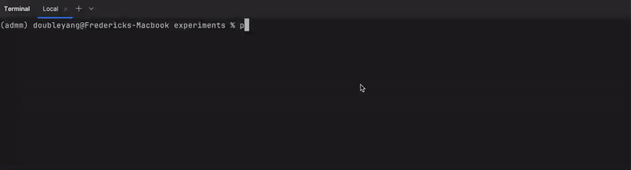
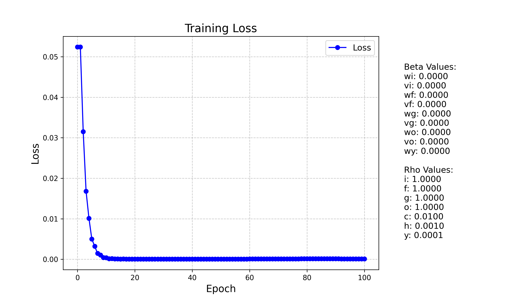
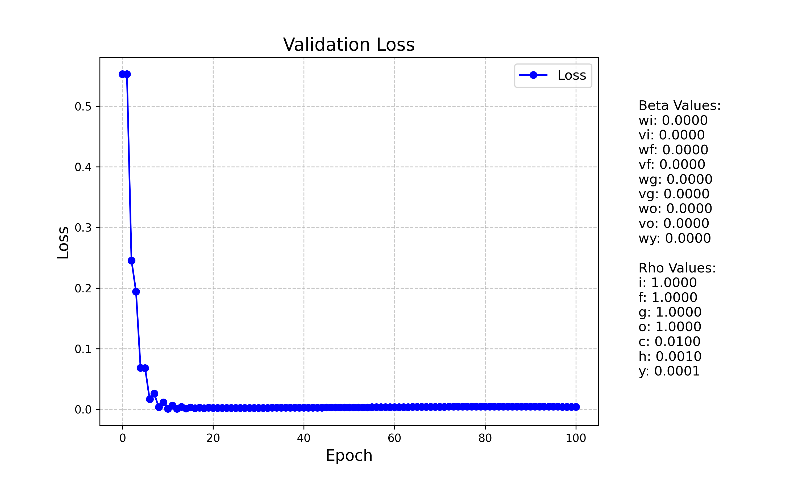

# README

> © 2025 Yang, et al. Version Release/0.0, updated in 2025.

## Introduction

This is the repository where we implement some toy simulations for our paper *An ADMM-Based Optimization Strategy with Global Convergence for LSTM*. The project is implemented with Python 3.10, Anaconda 23.9.0. A detailed `requirements.txt` file is included in the top-level directory. 

## Replication Guidance

To replicate our simulation, the following requirements need to be satisfied.

- Python 3.10 or higher.
- Anaconda or PyPI package managers.
- CPU with more than 2 cores, 4GB memory and 4GB free space (log files could be large).

After installing necessary dependencies, follow the next steps to run our demo:

1. Create a new conda or virtual environment to avoid dependency conflicts: `conda create --name=admm python=3.10`.
2. Switch to the new conda environment: `conda activate admm`.
3. Install the requirements: `bash install.sh admm` (Or `bash install.sh <conda_env_name>`, replace `<conda_env_name>` 
   with the conda environment name with your own).
4. Run the demo (Google Stock Prediction): `python demo.py`.

Or you can refer to the following GIF guidance:

The training and validation loss is likely to be as follows.

    <figure>
        
        <figcaption>Training Loss</figcaption>
    </figure>
    <figure>
        
        <figcaption>Validation Loss</figcaption>
    </figure>

> The above pictures are for reference only and do not represent the real effect of our work. To see the real effect, please refer to our paper.

## Command Line options

Our demo program `demo.py` offers the following 5 command line options for controlling the training process.

|   Option    | Alias |           Explanation            | Default Value |        Type        |
|:-----------:|:-----:|:--------------------------------:|:-------------:|:------------------:|
|  --dataset  |  -d   |      The dataset to be used      | `GoogleStock` |       string       |
|   --epoch   |  -e   |         The epoch number         |     `30`      |     int > `0`      |
| --num_train |  -nt  |  The number of training samples  | String `all`  | `all` or int > `0` |
|  --num_val  |  -nv  | The number of validation samples | String `all`  | `all` or int > `0` |
|  --hidden   |       |     Hidden size of the LSTM      |     `10`      |        int         |
|    --yes    |  -y   |     Skip parameter checking      |               |
|  --version  |  -v   |       Display version info       |               |
|   --help    |  -h   |        Display help info         |               |

The following commands are valid, and you might want to try them as a start.

`python demo.py`

`python demo.py --dataset GEFCOM2012 --epoch 100 --num_train all --num_val all --hidden 10`

`python demo.py -d GoogleStock -e 50 -nt all -nv 30`

Use `--help` to display help message and  `--version` to display the version.

## Dataset Specification

The following datasets are defined in `dataset.py` and available for use. Use `--dataset <dataset_name>` to specify the dataset you want to try with our demo. Note that we do not own the copyright of these datasets. For more information, please refer to their official websites.

| Dataset Name |                                                    Description                                                    |
|:------------:|:-----------------------------------------------------------------------------------------------------------------:|
|  GEFCOM2012  | [Global Energy Forecasting Competition 2012](https://www.sciencedirect.com/science/article/pii/S0169207013000745) |
| YahooFinance |       [Yahoo Finance Dataset](https://finance.yahoo.com/) [`yfinance` Library (PyPI)](https://pypi.org/)       |
|     HAR      |   [HAR Official Website](https://archive.ics.uci.edu/dataset/240/human+activity+recognition+using+smartphones)    |

## Parameter specifications

Since there are a load of parameters, we do not provide a command line option for adjusting these values.
Readers who are interested in trying their own parameters can either write their own demo, or simply edit
in file *parameters.py*, where there is an `example_parameter_dictionary` tuned for supported datasets.

## License

This project is licensed under the [GNU General Public License v2.0](https://www.gnu.org/licenses/old-licenses/gpl-2.0.html).

### Additional Terms

- When using or redistributing this code, you **must** properly cite the following paper:

  "An ADMM-Based Optimization Strategy with Global Convergence for LSTM" by Yang, et al.

- This code is provided "as-is" without any warranty of any kind, express or implied, including but not limited to the warranties of merchantability or fitness for a particular purpose.
  
### Commercial Use

Commercial use of this code (e.g., for paid online courses, or in-profit ventures) is not permitted under this license. If you wish to use the code for commercial purposes, please contact the author for a commercial license.

